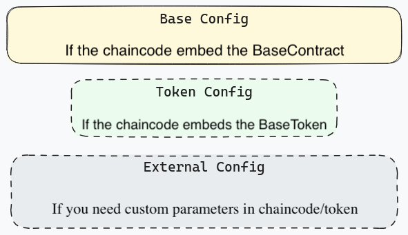

# Chaincode Configuration

Description of options for configuring cheincodes created on the basis of foundation library.

## TOC

* [Chaincode Configuration](#chaincode-configuration)
  * [TOC](#toc)
  * [Description](#Description)
    * [JSON-configuration](#json-configuration)
      * [Contract Configuration](#Contract-Configuration)
      * [Token Configuration](#Token-Configuration)
      * [External configuration](#External-configuration)
  * [Links](#links)

## Description

Chaincodes are configured by calling the `Init()` method of the `Chaincode` structure and passing a set of parameters to it.
Currently, there are 2 variants of chaincode configuration:
- configuration via json
- configuration via positional parameters (deprecated)

### JSON-configuration

One parameter is passed to the `Init()` method, which represents a string in JSON format.
The configuration (JSON) consists of several sections:
- contract configuration
- token configuration
- external configuration



Example json configuration:

```json
{
  "contract": {
    "symbol": "SC",
    "robotSKI": "380499dcb3d3ee374ccfd74cbdcbe03a1cd5ae66b282e5673dcb13cbe290965b",
    "admin": {"address": "249vo8kfbRxN9EmZTQZrX2LF7kTtvF7GtDiR52WxWycHvNvh5a"},
    "options": {
      "disabled_functions": ["TxBuyBack", "QueryAmount"],
      "disable_swaps": true,
      "disable_multi_swaps": true
    }
  },
  "token": {
    "name": "Some coin",
    "decimals": 8,
    "issuer": {"address": "2DSqUTYJnM6YgAQdAPJwQHcCwBE2bkS8BDhmjWjrLE89GZ6pva"}
  },
  "coin_important_param": "some important information here",
  "coin_max_count": 1000
}
```

If a keycode embeds `BaseContract`, it must have all mandatory parameters in `ContractConfig`.
If a chaincode embeds `BaseToken`, it must have all mandatory parameters of `BaseToken` filled in addition to ContractConfig.
If a keycode implements `core.ExternalConfigurable` interface, then it has configuration peculiarities, and it is necessary to look at the config inside this keycode.

#### Contract Configuration

Includes a set of parameters that are responsible for basic smart contract configuration:
- smart contract text identifier
- robot key identifier (SKI)
- keycode administrator
- smartcontract settings that allow you to lock functions, swaps, and multiswaps.

_The smartcontract identifier may contain a hyphen. For this reason, it is not recommended to use a hyphen as a
delimiter in code._

Read more in [ContractConfig](../proto/config.proto).

#### Token Configuration

Includes parameters specific to the token:
- name
- dimensionality
- what it is backed by
- issuing user
- commission management user
- redemption management user

Read more in [TokenConfig](../proto/config.proto).

#### External configuration

In addition to the basic smart contract and token settings, sometimes there is a need to add something else.
For this purpose the concept of external configuration is implemented. The changecode must implement the `core.ExternalConfigurable` interface.

The `ValidateExtConfig` method needs to describe the validation of the parameters.
In the `ApplyExtConfig` method, implement config proofreading and filling custom fields in the changecode.
`ValidateExtConfig` triggered by `Init()` of the chaincode, but `ApplyExtConfig` every time `Invoke` chaincode. 

Read more in the test [TestInitWithExtConfig](../test/unit/config_extended_test.go).

### Configuration via position parameters

It is recommended not to use this option anymore, it is left only for backward compatibility and will be completely removed in the future.

It is important to note that the first 2 items in the configuration are backend SKI and robot SKI. They must be specified for all chincodes.
Next are those parameters that are defined in the cheincode itself.

Now the library is working in backward compatibility mode, so it is not possible to make new cheincodes using positional parameters.
All old chaincodes for which this mechanism is defined are prescribed in the method [ParseArgsArr()](../internal/config/config.go).

## Links

- [Configuration description in proto](../proto/config.go)
