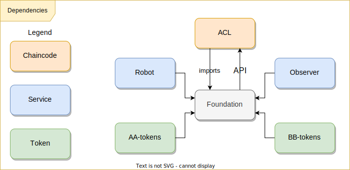

# Versioning

Description of the versioning process of Foundation.

## Table of Contents

- [Versioning](#versioning)
  - [Table of Contents](#table-of-contents)
  - [Description](#description)
  - [Versioning Process](#versioning-process)
      - [Patch](#patch)
      - [Minor](#minor)
      - [Major](#major)
        - [ACL](#acl)
  - [Components Dependent on the Foundation](#components-dependent-on-the-foundation)
  - [Backport and LTS](#backport-and-lts)
  - [Links](#links)

## Description

* The project uses [semver](https://semver.org/).
* Versioning is done using tags in the format **vA.B.C**.
  - v1.0.0
  - v2.0.1
  - v3.1.1
  - v4.5.6

* Long-Term Support (LTS) releases are created with long-lived branches in the form of **vA**
 - v1
 - v2
 - v3
 - v4

* Refs below are considered protected:

```
v*.*.*
```

```
v*
```

## Versioning Process

Description of the versioning process. Changes to the library can be classified into three types:
  - patch
  - minor
  - major

Examples of change classifications:

* Incompatible changes have been made to the API. Public methods have been removed from the structures **ChainCode, BaseContract, BaseContractInterface**, or **BaseToken**. Changes to the public methods have been made in terms of names, the number of method arguments, changes in method arguments, or changes in argument types or return values; (#major)

* Incompatible changes have been made to the execution of basic functions - **swap, multiswap, batchExecute, nonce, Chaincode.Init, Chaincode.Invoke** for existing methods. This requires changes in dependent components such as **robot** and **observer**; (#major)

* Incompatible changes to **chaincode events** for existing methods. This requires changes in dependent components such as **robot** and **observer**. (#major)

* Changes to the names of public fields or methods in public structures, proto files, or any fields/methods **deleted**. (#major)

* Changes to the names of public fields or methods in public structures, proto files, or any fields/methods **added**. (#minor)

* Bug fix in a function that does not change input parameters and return values. (#patch)

* Addition of a private structure or a private function. (#patch)

* Changing and deleting error messages. (#minor)

* Adding new error messages. (#patch)

At present, there is a cyclical dependency with the ACL chaincode. ACL uses proto and types from Foundation, and Foundation depends on ACL through its API.



ACL is versioned independently of Foundation and, in general, is not tied to the latest version of Foundation, as major changes in Foundation usually do not affect the logic of ACL.

#### Patch

The process of releasing a version with bug fixes is described in the following steps:

* Create a branch in the form of `{{issue_number}}-{{short_subject}}`

```
1234-fix-bug-with-calculating-fee
```

* Work on or create unit tests to identify the error.
* Make corrective changes.
* Forcefully trigger integration testing in the branch.
* Prepare an MR to the main branch.
* To create a release tag, you must change the RELEASE NOTES (MR/commit to master) and create a release tag only after passing the pipeline.
* Creating a new patch release with multiple independent fixes is allowed.
* Notify colleagues about the release

#### Minor

The process of releasing a version with added functionality:

* Create a branch in the form of `{{issue_number}}-{{short_subject}}`

```
1234-new-feature-with-multi-emission
```

* Develop new functionality.
* Create unit tests covering the new functionality.
* Create integration tests covering the new functionality.
* Forcefully trigger integration testing in the branch.
* Prepare an MR to the main branch.
* To create a release tag, you must change the RELEASE NOTES (MR/commit to master) and create a release tag only after passing the pipeline.
* Any new functionality is released with a new tag with an updated minor version; combining multiple features into one release is **not allowed**.
* Notify colleagues about the release.

#### Major

The process of releasing a new version with breaking changes.

**IMPORTANT:** When developing new functionality, always try to maintain backward compatibility.

* In the process of developing new functionality, a violation of backward compatibility is detected.
* Create a temporary branch, `tmp-v{{A}}`

```
tmp-v4
```

* Merge all branches that provide new functionality and lead to breaking backward compatibility into a common branch.
* Create unit tests covering the new functionality.
* Create integration tests covering the new functionality.
* Forcefully trigger integration testing in the long-lived branch.
* Prepare an MR to the main branch.
* To create a release tag, you must change the RELEASE NOTES (MR/commit to master) and create a release tag only after passing the pipeline.
* Before making backward-incompatible changes, make sure there is no other way to introduce these changes. Discuss this with the Foundation project maintainer.
* Notify colleagues and stakeholders about the release

##### ACL

* **Changes to Foundation that affect the ACL API must be backward compatible.**
* Changes affecting the ACL API should be approved by the architecture committee.
* [Details here](#acl)

Summary of actions when changing the ACL API:

- ACL - create LTS versions.
- ACL - release a new major version.
- Foundation - release a new version.
- ACL - create a new branch with an updated go.mod, dependencies, and method improvements.
- Make changes to dependent services.
- Rebuild all

 customer chaincodes.
- Redeploy all customer chaincodes.

## Components Dependent on the Foundation

Components dependent on Foundation.

When releasing major versions, dependent components should be taken into account:

* Chaincodes
* Robot
* Observer

You can get a detailed list using a global search and the `gitgit` utility.

## Backport and LTS

A situation may arise where a customer has deployed chaincode versions with an older Foundation version on their systems, and they require new functionality from Foundation.

For this purpose, the mechanism of LTS branches and backporting changes is used. By agreement with customers, the lifespan of LTS branches is 6 months from the time of tagging a major version. LTS branches have the form `v{{A}}`.
  - v1
  - v2
  - v3

Sequence of actions:

* Develop new functionality (actions from [minor](#minor)).
  When merging MR, do not delete the branch with the new functionality.
* Determine the version of Foundation at the customer's site and create an LTS branch with this version in the Foundation repository. The LTS branch can already exist in the repository.
* Forcefully trigger integration testing in the LTS branch.
* Prepare an MR to merge the branch with new functionality into the LTS branch. There may be backward-incompatible changes in ACL; see [details here](#acl).
* To create a release tag, you must change the RELEASE NOTES (MR/commit to the LTS branch) and create a release tag only after passing the pipeline.
* Notify colleagues and the customer about the release

## Links

* No